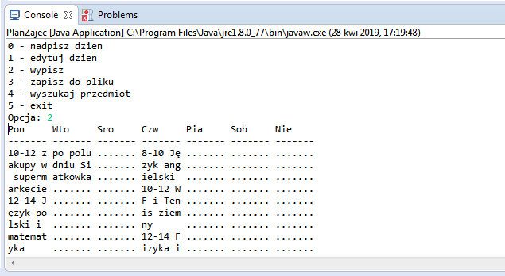

# Project Name
"The Powerful of Console class" - useful Task Schedule program, written in one Java class

## Table of contents
* [General info](#general-info)
* [Screenshots](#screenshots)
* [Technologies](#technologies)
* [Setup](#setup)
* [Features](#features)
* [Status](#status)
* [Inspiration](#inspiration)

## General info
Simple, console application called Task Schedule

## Screenshots

## Technologies
* JAVA

(
especially Scanner class & other import:

import java.io.File;
import java.io.FileNotFoundException;
import java.io.PrintWriter;
import java.util.LinkedList;
import java.util.List;
)

## Setup
In command line:
javac PlanZajec.java
java PlanZajec

## Code Examples
Show examples of usage:
`public static void print(List<List<Entry>> planZajec) {
	int FIELD_SIZE = 7;
	p("Pon\tWto\tSro\tCzw\tPia\tSob\tNie");
	p("-------\t-------\t-------\t-------\t-------\t-------\t-------");`

## Features
Plan of application intend:
* tabbed divides of each day week
* matrix of plan alignment
* uses of maximal strenght of Scanner class in pane options
* clever Task Schedule text formatted

## Status
Project is: _finished_

## Inspiration
Inspiration to this project was *.nfo file from... keygen zip archive ;-) 
Yess I'm affected to so on project which have so kind of that style :-0
